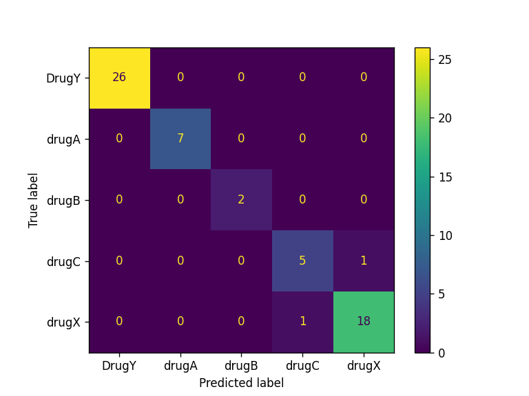

# CICD-for-Machine-Learning

 

Learn how to automate model training, evaluation, versioning, and deployment using GitHub Actions with the easiest MLOps guide available online.

## Project Description
In this project, we will be using scikit-learn pipelines to train our random forest algorithm and build a drug classifier. After training, we will automate the evaluation process using CML. Finally, we will build and deploy the web application to Hugging Face Hub. 

From training to evaluation, the entire process will be automated using GitHub actions. All you have to do is push the code to your GitHub repository, and within two minutes, the model will be updated on Hugging Face with the updated app, model, and results.

> **Follow the tutorial:** https://www.datacamp.com/tutorial/ci-cd-for-machine-learning

## Pipeline

## Results
| Model                  | Accuracy | F1 Score |
|------------------------|----------|----------|
| RandomForestClassifier | 97.0%    | 94.0%    |

